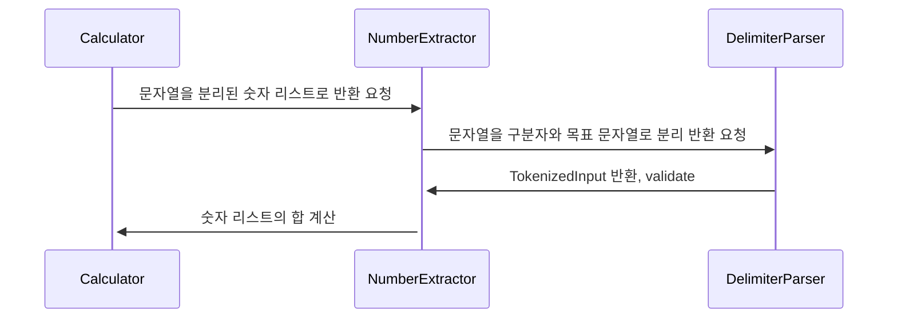

# 우아한테크코스 8기 프리코스 - 1주차 : 문자열 덧셈 계산기

## 기능 목록

- [x] 빈 문자열을 입력할 경우, 0을 반환
- [x] 숫자 하나를 입력할 경우, 해당 숫자를 그대로 반환
- [x] 쉼표와 콜론을 구분자로 사용하여, 숫자들의 합 반환
- [x] //와 \n 사이의 문자를 커스텀 구분자로 사용하여 합 반환
    - [x] //와 커스텀 구분자 입력 후 enter으로 개행하는 경우 합 반환

---

## 예외 목록

### IllegalArgumentException 발생

- [x] 음수가 입력된 경우
- [x] 숫자 자리에 문자가 입력된 경우
- [x] 입력값이 int 범위를 넘어가는 경우
- [x] 계산 결과가 int 범위를 넘어가는 경우
- [x] //로 시작하지만 \n이 없고 다음 줄을 읽을 수 없는 경우
- [x] //와 \n 사이에 구분자가 없는 경우
- [x] 문자 2개 이상으로 이루어진 구분자가 있는 경우

---

## 사고 흐름

1. README: 기능 목록, 예외 목록 작성
2. ApplicationTest: README에 맞게 예외 케이스 작성
3. 설계 (MVC)

    - M (domain) - V (view) - C (Controller) 패키지 추가
    - view 패키지에 클래스 추가
    - controller 패키지에 클래스 추가
    - view (ConsoleInput, ConsoleOutput) 와 domain (Calculator) 연결
    - runCalculator() 메소드에서 view와 domain 이용

---

4. domain 패키지 설계

---

Calculator에서 시작

- int add(String input) 에서 input이 유효한 숫자 리스트로 변환되어야 합을 계산할 수 있음.

---

NumberExtractor 클래스와 List<Integer> extract(String stringInput) 메소드 생성

- String stringInput은 구분자를 이용해 분리되어야 함.
- 이때 커스텀 구분자가 있다면, 먼저 분리해서 반영해야 함.

---

_TokenizedInput 레코드를 생성: delimiter과 targetString 분리를 위함._

DelimiterParser 클래스와 TokenizedInput parse(String input) 메소드 생성

- [ ] Pattern.compile(regex)
- [ ] Matcher

---

NumberExtractor에서는 DelimiterParser 클래스의 parse 메소드에서 받은 TokenizedInput을 이용하여 문자열을 분리함.

- 분리한 문자열을 정수로 변환하여 List<Integer> 반환

- [ ] Arrays.stream()
- [ ] mapToInt(IntegerValidator::validate) 에서 ::의 역할
- [ ] boxed().toList() 에서 boxed()의 필요성

---

Calculator에서는 NumberExtractor에서 받은 List<Integer>의 합을 구함.

--- 

5. Application에 의존성 주입

    - [ ] "의존성 주입"이 어떤 의미인지

---

6. Validator 설계

    - domain 설계 진행하면 대부분의 테스트 케이스는 통과, 남은 건 예외 케이스
    - hasMessage 이용하면 정확히 원하는 대로 예외를 처리했는지 확인 가능
    - 그냥 어쩌다가 예외 처리가 되는 경우도 있으니 메시지가 일치하는지 (또는 포함하는지) 확인하는 것이 좋을 듯?

---

